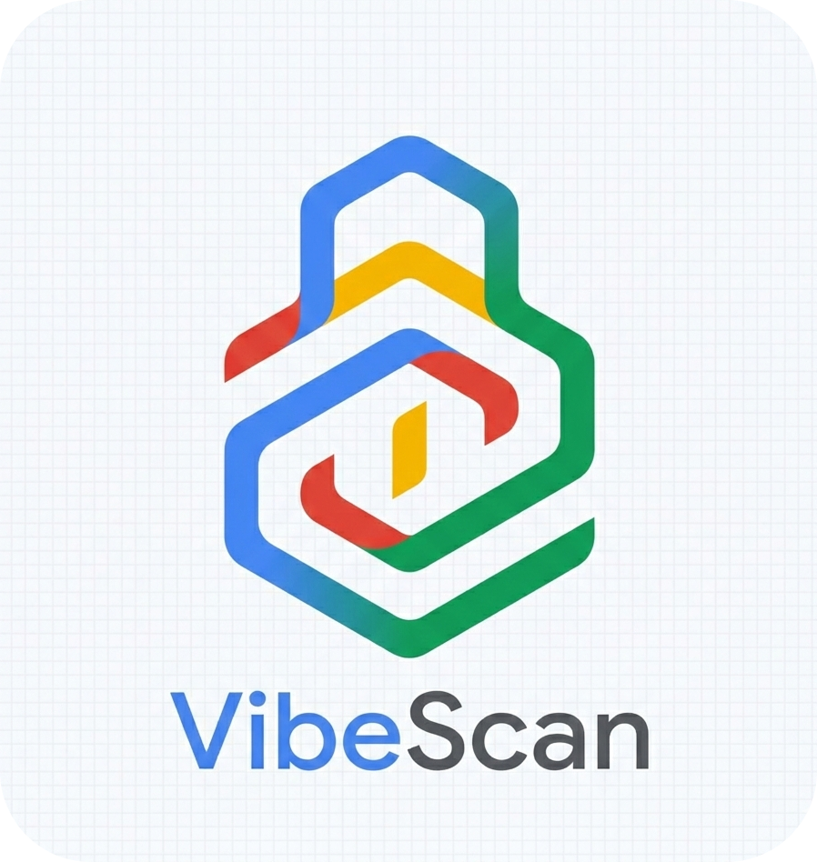

<div align="center">



# VibeScan

### Pre-publish security analysis tool to detect AI hallucinated dependencies and slopsquatting.

[🌐 Visit Website](https://abinvarghexe.github.io/vibescan/) • [📦 PyPI](https://pypi.org/project/vibescan/) • [📄 Documentation](https://abinvarghexe.github.io/vibescan/get-started.html)

[](/LICENSE)
[](https://www.python.org/downloads/)

</div>

---

## 🚀 Installation

Install directly from source:

```bash
git clone https://github.com/AbinVarghexe/vibescan.git
cd vibescan
pip install -e .
```

*Requires Python 3.7 or higher.*

## ✨ Features

- **Dependency Scanning:** Automatically detects `package.json` (NPM) and `requirements.txt` (PyPI) in your projects.
- **Hallucination Detection:** Instantly flags non-existent packages generated by AI coding assistants.
- **Typosquatting Protection:** Identifies malicious packages trying to impersonate popular, legitimate libraries.
- **Risk Scoring:** Evaluates package age, download counts, and registry availability to calculate a comprehensive 0-100 Risk Score.
- **Actionable Reports:** Categorizes scanned dependencies into Safe, Suspicious, and Critical risks.
- **CI/CD Ready:** Exits with failure codes on critical risks to block unsafe builds.

## 🛠️ Usage

Scan the current directory:
```bash
vibescan
```

Scan a specific project path:
```bash
vibescan /path/to/your/project
```

Enable debug output for more detailed logs:
```bash
vibescan --debug
```

## 📚 Documentation

For a detailed code-by-code overview of how VibeScan operates, please visit our [Documentation Site](https://abinvarghexe.github.io/vibescan/get-started.html) or check the `docs/` folder in this repository.

## 🤝 Contributing

Pull requests are welcome. For major changes, please open an issue first to discuss what you would like to change.

### Disclaimer

This tool provides heuristic guidance based on public registry metadata. It is not an absolute guarantee of software security. Always manually review suspicious packages.

### License

Copyright © 2026 VibeScan Contributors

Licensed under the MIT License
